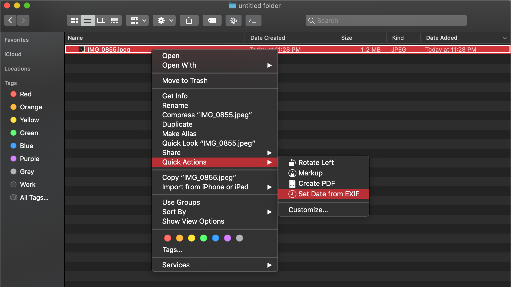

# Set Date from EXIF

A simple *Automator.app* *workflow* quick action to change the **Date Created** attribute of <u>image</u> files to the creation date listed in the **EXIF**.

This allows images to be sorted by actual *time taken* in *Finder*, since it still cannot show **EXIF** data as columns.

## Compatibility

Tested and confirmed working:

- MacOS Catalina 10.15

Please let me know your system version if it doesn't work for you.

## Installation

1. *Clone or download*

2. Double click on *Set Date from EXIF.workflow*

3. Confirm install


## Usage

1. Select files and folders in *Finder*

   [^All files in selected folders will be searched and changed recursively; Has no effect on non-image files]: 

2. Right Click or Control+Click

3. Quick Actions > Set Date from EXIF


## Notes

The actual work is done in a shell script, which takes *selected files and folders* in *Finder* as input.

The shell script is here:

```shell
#!/bin/zsh
change_date()
{
	# Get date from EXIF using 'mdls' command
	exifDate="$(mdls -name kMDItemContentCreationDate -raw "$1")"
	# Change date to timezone on host computer
	exifDate="$(date -jf "%Y-%m-%d %T %z" "$exifDate" +"%Y-%m-%d %T %z")"

	# Format date for 'touch' command
	exifDate="${exifDate:0:16}"
	exifDate="${exifDate//"-"}"
	exifDate="${exifDate//" "}"
	exifDate="${exifDate//":"}"
	# echo "$exifDate"

	# Change "Date Created" using 'touch' command
	touch -ct "$exifDate" "$1"
	# echo Success!
}

for i in "$@"; do
	# If selected item is directory
	if [[ -d "$i" ]]; then
		cd "$i"
		# Method to recursively loop through files/dirs even with names that contain whitespace
		find . -type f -print0 |
		while IFS= read -r -d '' file; do
			# Check if file is image
			if [[ $(file "$file" | grep -i image) != "" ]]; then
				change_date "$file"
			fi
		done
	# if selected item is file
	elif [[ -f "$i" ]]; then
		# Check if file is image
		if [[ $(file "$i" | grep -i image) != "" ]]; then
			change_date "$i"
		fi
	fi
done
```

This is my first time actually writing a shell script, so definitely prone to errors and not following best-practices; welcome to any critism for improvements.
